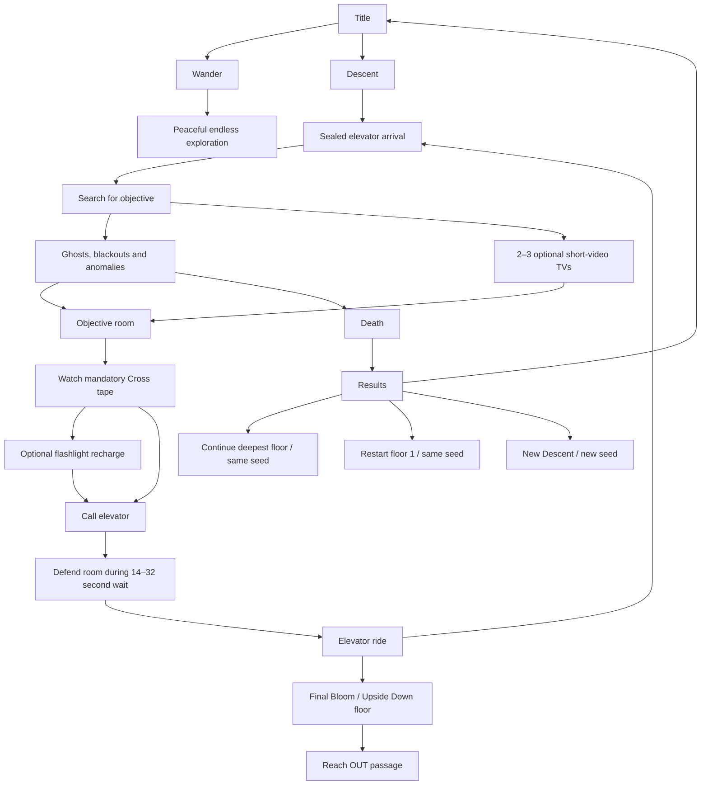

# Game Loop Audit

**Project:** It wants you to stay
**Audit revision:** 4
**Audit date:** 2026-08-06

## Executive verdict

This is now a good, recognizable horror game rather than a procedural
environment showcase looking for a game loop.

The strongest parts are the environments, the ordinary ghost encounter rules,
the uncertainty created by blackout architecture changes, and the fixed
floor-to-floor story structure. The largest fairness failures from the first
audit have been removed: the uncounterable pursuer is gone, ghosts follow
through doorways, deaths retain the deepest floor, a genuinely lost player can
receive hidden architectural assistance, and watching the story tape—not
filling the flashlight—is now the only elevator admission requirement.

The game is not yet a complete story campaign. All ten long-form Cross
recordings are now implemented, but the planned intro does not exist in the
runtime and the final exit currently cuts directly to an `OUT` results screen
instead of the player-centered dread outro in `docs/STORY.md`. The complete run
also remains long and mechanically repetitive, and late difficulty is driven
more by frequency and endurance than by new tactical ideas.

| Area | Current assessment |
|---|---|
| Atmosphere and identity | Excellent |
| Environmental variety | Excellent |
| Ordinary ghost encounters | Strong and unusually fair |
| Blackout mechanic | Strong, now mechanically consequential |
| Difficulty progression | Clear, but too frequency-driven |
| Failure and recovery | Strong |
| Full-run pacing | Still needs substantial tuning |
| Narrative structure | Strong plan, incomplete content |
| UX and accessibility | Underdeveloped |
| Automated confidence | Good coverage with important blind spots |

**Current playable core:** approximately **8/10**.  
**Current readiness as a complete, shippable story campaign:** approximately
**6/10**.

That distinction matters. The systems are now good enough to support the game,
but the campaign still needs its intro and ending, pacing pass,
late encounter tuning, and shipping UX.

This audit is evidence-based but not a substitute for a human full-run
playtest. It traced the current code, re-ran the focused gameplay contracts,
and measured generated routes and video durations. Subjective full-session
conclusions remain inferences from those systems and timings.

## The current game loop

Descent has eleven fixed floors:

1. Casino
2. Mall
3. Office
4. Airport
5. School
6. Prison
7. Asylum
8. Poolrooms
9. Annex
10. Monolith
11. Bloom / Upside Down

The first ten floors use the objective-room ritual. Bloom has no Cross tape
and ends at the exit.

The live repeated floor loop is:

1. Leave the arrival elevator.
2. Search using a straight-line distance readout.
3. Survive ghosts and blackouts while the next environment begins bleeding in.
4. Optionally watch rare short recordings.
5. Reach the objective room and watch its complete long recording.
6. Optionally recharge.
7. Call the lift and remain in the objective room until it arrives.
8. Enter the lift and descend.

That is a strong loop for several floors. Repeating essentially the same ritual
ten times is still the campaign's central mechanical weakness.

## Where the game has materially improved

### Fixed story order and meaningful continuation

The old random floor order is gone. The authored order is seed-independent,
while the seed still changes room construction, routes, props, and events.

Progress now stores:

- The current building seed.
- The deepest floor reached.
- The optional short-tape no-repeat history.

After death, Continue returns to the deepest reached floor on the same seed.
Restart begins at floor one without deleting the deeper unlock. New Descent
creates a fresh building. Resources reset to a full, switched-off flashlight.

This removes the former all-or-nothing run structure and makes a long campaign
reasonable to attempt.

### The unfair pursuer is gone

The separate unburnable, never-ending pursuer has been removed. All remaining
hostile figures use the shared counterplay:

- 1.25 m/s while visible.
- 4.5 m/s while unseen.
- An unseen approach stops at 3.6 m, preserving a visible response window.
- 1.5 seconds of accurate flashlight exposure burns one away.
- A figure can chase through three doorway boundaries.
- It can give up only after that chase while separated from the player.
- It never dissolves while sharing the player's room.

This is one of the game's best systems. Seeing a ghost creates a real decision:
spend battery, control distance while watching it, or run through enough
architecture to escape.

### Blackouts now change the world

Every actual blackout is preflighted around a safe new wall opening. If the
game cannot create one, the blackout waits instead of producing a fake color
wash, unexplained red light, or fallen debris.

The opening is a real persistent topology edge shared by:

- Rendered wall geometry.
- Collision.
- Streaming rebuilds.
- Route calculations.
- Ghost navigation.

Ordinary blackouts prefer nearby route-neutral openings. After 50 seconds of
movement without improving the best graph distance, with at least six rooms
visited, the next eligible blackout is pulled within seven seconds and tries
to create a doorway whose far side is at least two graph steps closer to the
lift. Helpful and decorative doors have identical presentation and both remain
within four traversable rooms.

This is a particularly good solution because it solves frustration without
turning the building into an obvious hint system. A new door may be help, or it
may simply be the building changing.

### The elevator gate now respects the actual objective

The objective tape is the sole elevator admission requirement. The player no
longer reaches the lift, finishes the story scene, and then gets rejected for
having a partially depleted flashlight.

The charging station remains valuable preparation for the lift vigil and next
floor, but it is optional. This is cleaner, fairer, and narratively correct.

## What is fun now

### Exploration has purpose

The fixed narrative order gives the procedural environments an arc. The bleed
system previews the next world through fog, room tone, and foreign props as the
player nears the objective. The elevator rooms and Cross recordings provide a
reason to keep going beyond seeing another generated room.

Eleven visually distinct environments are still the game's greatest source of
replay value. A repeated seed supports mastery; a new seed changes the building
without scrambling the story.

### Horror events have distinct grammar

The game is not relying on one scare:

- Hostile ghosts create the resource-and-distance combat loop.
- Passing shadows cross narrow hallways at long intervals.
- Corner silhouettes require a genuine hidden-to-visible turn and dissolve
  harmlessly.
- Whispers create directional uncertainty.
- Heartbeat and breath communicate pressure and proximity.
- Blackouts impose a movement rule and permanently alter architecture.
- Backtracking anomalies make revisited rooms unreliable.
- Optional televisions create curiosity and relief without becoming mandatory.

The passing-shadow and corner systems share a 50-second quiet gate, and corner
apparitions are intentionally rare. This restraint helps them remain surprises.

### Forced passivity is mostly fair

Hostile figures are held during arrival presentation, blackouts, and tape
viewing. Passing shadows and corner apparitions also suppress themselves during
those states. The game generally does not demand that the player stop while
allowing a monster to close the distance.

During a blackout, the player has 2.6 seconds to stop on the first floor,
falling to 1.6 seconds by the last floor. After grace, movement fills a hidden
locate meter at 0.30 per second; roughly 3.33 cumulative seconds of movement
triggers the ambush. Standing still drains that meter at only 0.04 per second.
Three escalating positional cues communicate that something is locating the
player.

The rule is harsh, but it is understandable and has legal counterplay.

## Difficulty progression

The levels are not equally difficult.

### Quantitative ramp

| System | Early | Late |
|---|---:|---:|
| Route target band | 26–34 edges | 40–52 edges |
| Baseline floor pressure | 0.00 | 0.70 |
| Ambient successful ghost interval at baseline attention | 7–18 s | about 3.8–9.8 s |
| Blackout stop grace | 2.6 s | 1.6 s |
| Blackout duration | 5–8 s | 6.5–9.5 s |
| Lift wait | 14 s | 32 s on the final elevator floor |
| Attention recovery | 0.0025/s | 0.0016/s |
| Rule attention multiplier | 1.0× | 1.3× |

Threat equals persistent player attention plus floor pressure, clamped to one.
At maximum threat, successful ambient ghost intervals can fall to roughly
2.45–6.3 seconds. During the lift wait, the spawn scale is forced to 0.6 early
and approximately 0.33 on Monolith, making the vigil the floor's deliberate
combat peak.

The Poolrooms also halve walking speed while chest-deep in water. Theme order
therefore affects difficulty as well as appearance.

### What does not scale

- Individual ghost movement speed.
- Burn time and aim requirement.
- Three-door chase limit.
- Maximum simultaneous hostile ghosts: three.
- Flashlight capacity: twenty seconds.
- Full recharge time: ten seconds.

This makes the curve readable and avoids late stat inflation. However, it also
means later difficulty is primarily **more distance, more encounters, longer
waits, and less recovery**, rather than new tactical behavior. The curve becomes
more exhausting without becoming equally more interesting.

## Pacing and run length

The refreshed route audit sampled 55 deterministic routes:

- 26–52 graph edges.
- No fallback routes.
- No invalid or closed route edges.
- No arrival rooms lacking a wall-backed elevator.
- Approximately 5,033 m of shortest-path walking across a full run.
- Approximately 24.7 minutes of uninterrupted walking at 3.4 m/s.
- Approximately 3.8 minutes of lift waiting.
- Approximately 1.1 minutes of elevator rides.

The tape catalogue contains ten distinct long recordings, one per objective,
at about 60.7–61.3 seconds each. They produce about 10.2 minutes of mandatory
video in a complete run.

The present perfect-route run is therefore approximately:

> 24.7 min walking + 3.8 min waits + 1.1 min rides + 10.2 min tapes
> = **about 39.8 minutes**

That excludes:

- Wrong turns and exploratory loops.
- Ghost encounters.
- Blackouts.
- Charging.
- Optional televisions.
- Arrival presentation and interaction time.
- Performance stalls.

A knowledgeable completion is therefore around 40 minutes before ordinary
friction. A first completion still plausibly occupies 50–75 minutes.

Checkpoints make that duration survivable across sessions, but they do not
solve within-floor fatigue. Dying near the end of a late floor repeats the
same long route and objective tape from that floor's arrival.

## The largest remaining problems

### Addressed — Ten long Cross recordings

The tape catalogue now contains 48 recordings: ten long and 38 short. Each of
the ten elevator objectives receives its own fixed Cross chapter in source
order. The 38 short recordings and their no-repeat optional-TV pool are
unchanged.

### P0 — The intro and actual outro are not implemented

`docs/STORY.md` specifies one Cross intro and a player-centered outro in which
escape reveals only a larger, final form of dread.

The runtime currently has no intro-video path. Reaching the final exit calls
`run.finish(true)` and presents an `OUT` results screen. There is no exterior
sequence, recognition beat, search, or dreadful finality.

Until those sequences exist, the game has a beginning implied by documents and
an ending represented by a status label. This is the largest gap between the
current build and the intended story experience.

### P1 — The ten objective rituals still need variation

The improved loop is now:

> tape → optional charge → call → wait → ride

Removing mandatory charging was correct, but every non-final floor still uses
the same structure. Ten repetitions will expose the procedure beneath otherwise
varied environments.

Keep the tape consistent, but vary one surrounding action on selected floors:

- One lift arrives immediately after the tape.
- One floor requires restoring elevator power during the wait.
- One tape reveals which of two lift doors is real.
- One call creates a brief defendable fuse or signal task.
- One elevator arrives in stages, changing the room while the player waits.

Three or four variations across ten floors would be enough. They should change
decisions, not add arbitrary item hunts.

### P1 — Late difficulty needs direction, not only density

The hostile system has a cap of three and global audio sting cooldowns, but
ambient spawns and turn-triggered spawns remain separate channels. The shared
director now protects encounters from blackouts, whispers, apparitions, and
major one-shots, and provides recovery silence after the encounter ends. It
intentionally still permits reinforcement figures inside one active encounter.

At high threat, a new hostile can be attempted every few seconds. That risks
turning the signature ghost from an event into routine battery expenditure.

Recommended changes:

- Add a short global encounter cooldown after a clean burn or completed chase.
- Treat ambient and turn spawns as one hostile encounter budget.
- Prefer one strong late encounter over three overlapping ordinary ones.
- Add two or three recognizable behavioral archetypes instead of only reducing
  spawn intervals.
- Give selected floors one bounded, learnable tactical wrinkle.

### Addressed — Shared horror director

The game now has one lightweight pacing authority across hostile figures,
blackouts, hallway passers, corner apparitions, whispers, and distant structural
sounds. Individual systems still own their geometry, probabilities, and actual
behavior.

The director now guarantees:

- Objective and optional tape playback own the mix.
- Blackouts and live hostile encounters do not overlap.
- Passing shadows and corner apparitions receive an unobstructed visual beat.
- Whispers and structural knocks defer to major threats and presentations.
- Completed hostile encounters and blackouts end with pressure-scaled recovery
  silence.
- Wander bypasses Descent pacing and retains its ambient soundscape.

This addresses the architectural issue. A full-session playtest is still
needed to tune recovery lengths and confirm that late floors retain enough
unpredictability.

### P1 — Shipping UX and accessibility remain incomplete

There is still no full settings or pause layer for:

- Key remapping.
- Controller support.
- Mouse sensitivity and inversion.
- FOV.
- Camera-bob reduction.
- Audio-bus sliders.
- Subtitle or caption options.
- Photosensitivity-safe VHS and blackout presentation.
- Hold/toggle preferences.
- A conventional pause screen.

`V` and `B` are useful video-treatment controls. They are not a replacement
for accessibility settings. A 40–75 minute horror campaign needs a real pause
flow even with floor checkpoints.

## Important secondary issues

### Interrupted charging has contradictory contracts

`ChargingStation` says disconnecting never loses partial progress. `Player`
deliberately rolls an interrupted charge back to its session-start value, and
its own comment describes charging as an all-or-nothing defended action.

The focused charging audit passes empty-to-full timing and checkpoint reset,
but does not test interruption semantics.

Choose one behavior and align code, station copy, README, and tests. Now that
charging is optional, either choice can work, but hidden rollback is likely to
feel punitive.

### The distance instrument can still mislead

The HUD shows Euclidean distance, not graph distance or direction. A correct
dogleg can increase the number while moving the player closer along the actual
route.

The blackout-doorway assistance prevents prolonged hard stalls, so an explicit
arrow is no longer necessary. A subtle signal-strength cue after repeated route
improvement or backtracking could make progress legible without solving the
maze for the player.

### Checkpoints remain floor-granular

Continue restores the deepest floor, not the exact room, tape state, or blackout
topology at death. This is a clean and deterministic rule, but dying after the
tape or near a late objective repeats that entire floor.

Do not add room-by-room autosaves. Consider one retry concession only if
playtests show repeated late-floor abandonment—for example, a post-tape retry
state or a temporarily shortened same-floor route.

### Passing-shadow frequency is not measured in real play

Passing shadows require a narrow corridor, a valid crossing, 14–26 m distance,
and a strong forward-facing alignment. Airport, Mall, and Poolrooms are excluded
as broad themes. Failed attempts retry every 7–14 seconds.

The authored behavior is correct, but there is no telemetry proving how often
players actually see one on each eligible floor. Treat it as theme-specific set
dressing until playtest data demonstrates a reliable campaign cadence.

### Performance needs a fresh capture

The previous audit found visible single-chunk stalls on Annex and Bloom. This
revision did not reprofile frame times, so those old measurements should not be
presented as current fact.

The architectural risk remains: the streamer has a time budget between chunk
builds but cannot interrupt one heavy chunk constructor. Re-run continuous
movement captures through Annex and Bloom before shipping.

## Automated-test confidence and gaps

### Fresh passes

- Compile check: all eleven themes.
- Descent route audit: 55/55 deterministic, reachable routes.
- Blackout doorway audit: 11/11 ordinary doors route-neutral, 11/11 assistance
  doors useful, 22 physical geometry/rebuild checks.
- Descent runtime: arrival, topology, HUD, tape/lift flow, rules, and transition.
- Ritual audit: tape-only lift gate, altar, optional station, fixed order, bleed.
- Progress audit: seed, deepest floor, and short-tape cycle persistence.
- Ghost room audit: walls, offset door traversal, observed/unobserved movement,
  and three-room escape.
- Optional VHS audit: 48 tapes, ten long/38 short, 77/77 route sets placed.
- Flashlight charging audit: capacity, recharge time, reset, station coverage.
- Wander audit: hostile systems remain disabled.
- Title audit: main menu and information pages remain distinct.
- Corner-apparition audit: passed its geometry and asset contract.
- Horror-director audit: passed exclusive beats, recovery windows, scripted
  presentation holds, and Wander bypass.

### Known failures or blind spots

The survivability audit currently fails its own coverage requirement:

> 0 blackout ticks in 900 simulated seconds

It constructs `DescentRun` without a route. Live blackouts now require a safe
doorway proposal, so the run correctly postpones every blackout and the audit
proves nothing about blackout survivability. Repair the test with a real
`DescentRoute` and topology before treating it as a fairness gate.

The flashlight audit does not test interrupted-charge rollback. The horror
systems lack a campaign-level encounter-rate telemetry audit. Headless runtime
and VHS tests also emit dummy-renderer/resource cleanup warnings despite
passing, so visual correctness still requires rendered/manual checks.

Several documents and comments retain obsolete rules, including claims of a
topology-aware HUD needle and old multi-rule Descent behavior. Documentation
should be reconciled after current mechanics stabilize.

## Recommended development order

1. Implement the Cross intro and the player-centered dread outro.
2. Conduct one instrumented full completion with the current checkpointed
   build before changing route lengths.
3. Add three or four objective/lift ritual variations.
4. Tune late hostile density and director recovery from playtest data; add
   behavioral variety before
   adding more raw pressure.
5. Add pause, settings, remapping, controller, caption, and photosensitivity
   options.
6. Resolve interrupted charging semantics and expand its test.
7. Repair the survivability audit with real route/topology fixtures.
8. Reprofile Annex and Bloom streaming under continuous movement.
9. Reconcile README and `docs/DESCENT.md` with the live rules.

Instrumented playtests should include:

- A new player through Casino and Mall.
- An experienced 30-minute session.
- One complete eleven-floor run.
- One deliberate low-battery lift-vigil attempt.
- One intentional lost-player test on a late floor.

Track:

- Time per floor and time moving away from the graph objective.
- Death cause and battery at death.
- Hostile encounters per minute and overlapping encounters.
- Blackouts per floor and helpful-doorway activation.
- Optional tapes watched versus ignored.
- Lift-call cancellations.
- Repeated tape time after same-floor death.
- The floor where a player voluntarily stops.

## Bottom line

The game has crossed an important line: its core loop is now worth protecting.
Exploration has purpose, ordinary ghosts support real decisions, blackouts
change the building, and failure no longer destroys unreasonable amounts of
progress.

The main problem is no longer unfairness. It is **campaign completion and
composition**:

- The story still needs its intro and actual ending.
- Ten objective rooms repeat too much of the same ritual.
- Late difficulty adds pressure faster than it adds new ideas.
- The new shared director still needs full-run cadence tuning.
- Shipping UX is still absent.

Complete the narrative shell, vary several rituals, and direct the late-game
encounter rhythm before shortening the whole game. The current route length may
be acceptable once the campaign stops repeating the same mechanical and video
content. After those changes, this can move from a strong horror prototype into
a distinctive game people are likely to finish and remember.
